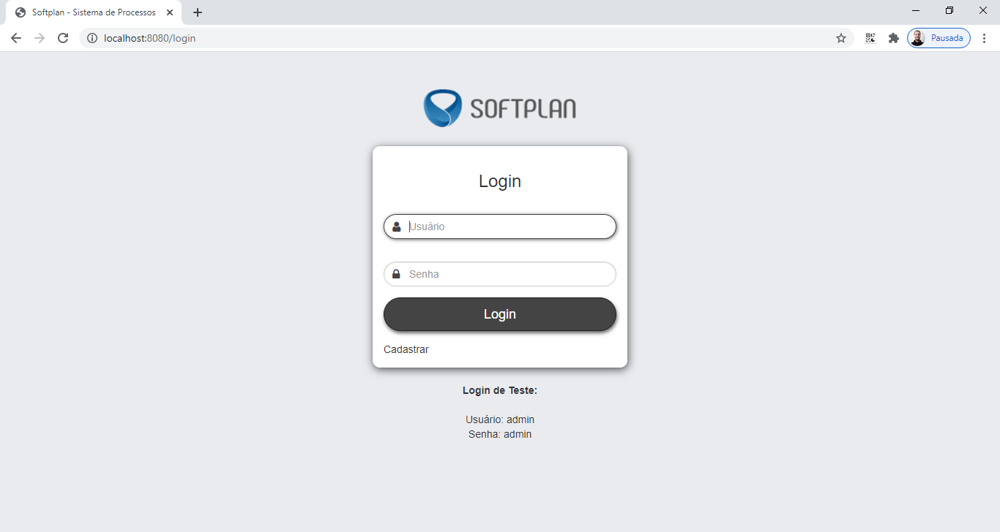
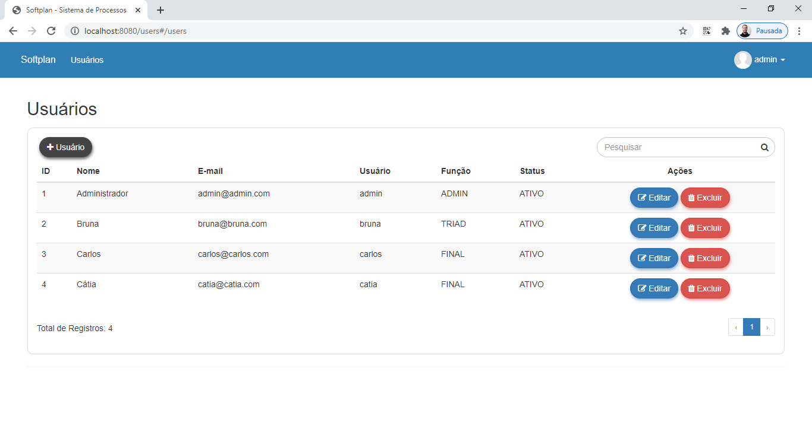
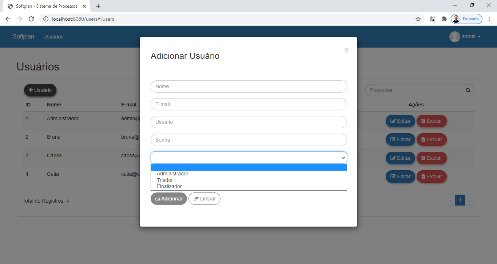
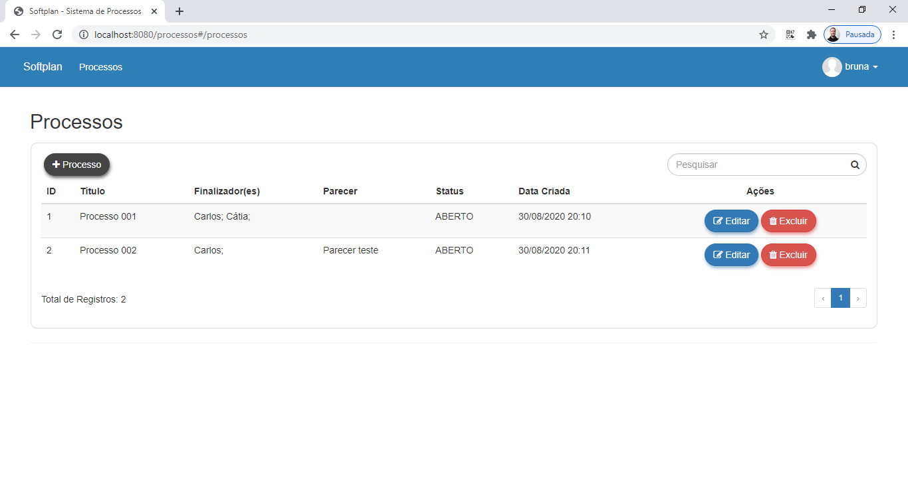
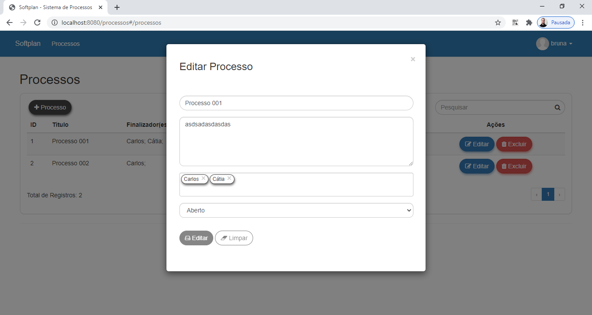
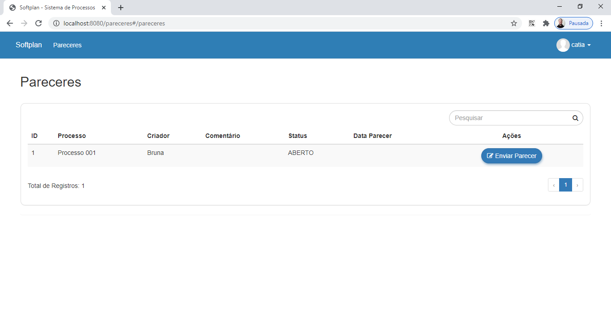
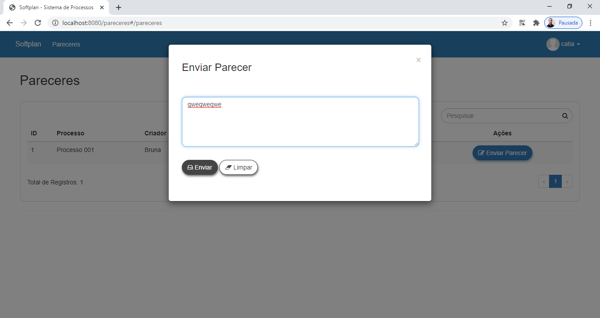

# Sistema de Processos

Avaliação técnica de um Sistema de Processos, desenvolvido em Java com Spring-Boot.

## Características

- CRUD
- API RESTful
- ACL
- Validation
- Filter
- Pagination
- Login
- Responsive
- JUnit
- Mockito

## Requisitos

- Java JDK 1.8
- Apache Maven >= 3.6.3
- PostgreSQL >= 12

## Tecnologias

- Java
- JPA
- Maven
- Spring
- Swagger
- CSS
- Jquery
- Bootstrap
- AngularJS
- PostgreSQL

## Instalação

```
$ git clone https://github.com/danilomeneghel/softplan-desafio-fullstack-danilo-meneghel.git

$ cd softplan-desafio-fullstack-danilo-meneghel
```

Crie o banco de dados com o nome sistema-processos em seu PostgreSQL.

Depois abra o arquivo "src/main/resources/application.properties" e coloque os dados de acordo com a conexão do seu banco de dados.

Para carregar o projeto, digite no terminal:

```
$ mvn spring-boot:run
```

Aguarde carregar todo o serviço web. <br>
Após concluído, abra o seu navegador o seguinte endereço: <br>

http://localhost:8080/

## Swagger 

Documentação da API RESTful: <br>

http://localhost:8080/swagger-ui.html

- Login
    - Username: admin
    - Password: admin

## Demonstração

http://sistema-processos.herokuapp.com/ <br>

- Login
    - Username: admin
    - Password: admin

## Licença

Projeto licenciado sob <a href="LICENSE">The MIT License (MIT)</a>.

## Screenshots

<br><br>
<br><br>
<br><br>
<br><br>
<br><br>
<br><br>
<br><br>
<br><br>

## Testes

<br><br>
<br><br>
<br><br>

## Modelo ER

<br><br>


Desenvolvido por<br>
Danilo Meneghel<br>
danilo.meneghel@gmail.com<br>
http://danilomeneghel.github.io/<br>
